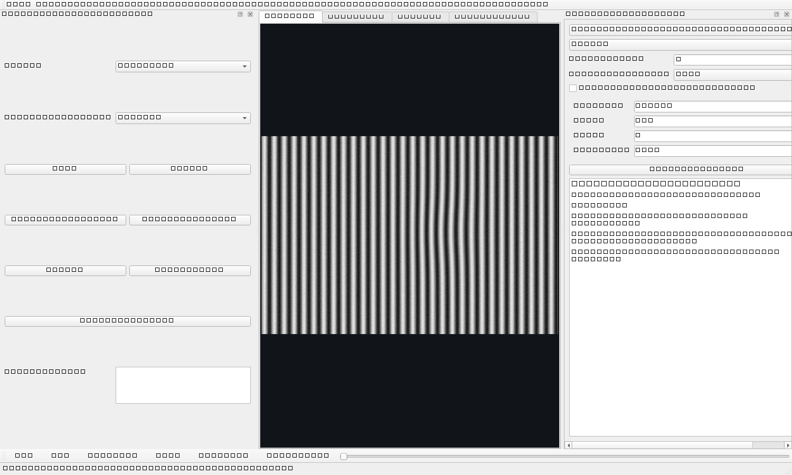

# Defleco LAB

Defleco LAB is an independent, experimental Windows desktop laboratory for comparing image-processing methods on reflected dynamic patterns. It is intended for research on local disturbances visible on glossy or specular surfaces using synthetic data, recorded sequences, image sequences, or an explicitly selected Basler camera.

> This is research software, not a calibrated measurement system, production inspection, or safety component. No metrological accuracy is claimed. A bounded hardware smoke test is documented below; optical performance, trigger/PTP behavior, and production throughput remain **NOT TESTED**.



## Highlights

- Single-frame gradient, Laplacian, Difference of Gaussians, local residual, structure tensor, Gabor-bank, and experimental directional-residual views.
- Integrated full-screen physical pattern output for fine stripes, checkerboard, spiral and concentric-ring experiments.
- Explicit pre-processing -> analysis method -> numeric response post-processing -> display pipeline with contextual controls and tooltips.
- Automated step-and-capture screening foundation that preserves RAW frames, runs a bounded offline recipe set, and exports identifiable grayscale/colour/50% overlay results.
- Multi-frame difference, temporal statistics/median residual, Farneback and DIS optical flow, DIC-like local phase-correlation grid, and temporal response fusion.
- One-axis image-motion estimation from multiple dedicated Motion ROIs, quality gating, robust median fusion, cumulative position, and masked translation compensation.
- Deterministic synthetic fringes, grid, checkerboard, speckle, translation, and localized deformation.
- Raw-frame record/replay so the same sequence can be evaluated repeatedly with different algorithms.
- Dark PySide6 engineering UI with typed parameters, display-only range/heatmap/alpha controls, shared compare ranges, zoom, pan, presets, Analysis ROIs, and Motion ROIs.
- CPU baseline; OpenCV CUDA is not required.

## Install on Windows

Requirements: Windows 10/11 x64, Python 3.11 x64. Hardware use additionally requires a compatible pylon Runtime and `pypylon 26.6`.

```powershell
git clone https://github.com/CZPavel/defleco-lab.git
cd defleco-lab
py -3.11 -m venv .venv
.\.venv\Scripts\python.exe -m pip install -e ".[dev]"
.\.venv\Scripts\python.exe -m defleco_lab
```

For optional Basler support:

```powershell
.\.venv\Scripts\python.exe -m pip install -e ".[basler]"
```

The application never selects real hardware by connection order. Discovery is read-only and the operator must select an exact discovered camera. Supported temporary acquisition settings are capability-checked and restored on disconnect where practical. Persistent User Sets, Force IP, firmware, network persistence, and GPIO output are intentionally outside scope.

### Easy local launch

For the first setup on Windows, open PowerShell in the repository and run:

```powershell
powershell -NoProfile -ExecutionPolicy Bypass -File .\setup_windows.ps1
powershell -NoProfile -ExecutionPolicy Bypass -File .\tools\create_windows_shortcut.ps1
```

This creates or updates the repository-local `.venv`, installs editable Basler support, performs a synthetic smoke test, and creates the user-local `Defleco LAB` Desktop shortcut. The pylon Runtime is not redistributed and must be installed separately when required.

For normal use, double-click `Start Defleco LAB.cmd` or the `Defleco LAB` Desktop shortcut. For visible startup errors and camera troubleshooting, use `Start Defleco LAB - Debug.cmd`. The optional idempotent `install_local_windows.ps1` performs setup and shortcut creation together.

After the first installation, `Update Defleco LAB.cmd` performs a safe fast-forward update of `main`, refreshes the editable Basler installation, and keeps the existing Desktop shortcut.

```powershell
powershell -NoProfile -ExecutionPolicy Bypass -File .\install_local_windows.ps1
```

## Quick synthetic experiment

1. Start with `Synthetic` and `fringes`.
2. Compare `Structure Tensor`, `Gabor Filter Bank`, and `Difference of Gaussians`.
3. Start Live, choose a multi-frame method, and change frame stride.
4. Draw cyan Analysis ROIs and orange Motion ROIs. Select an ROI and use `+`/`-` to resize or `Delete` to remove it.
5. Record a short raw session, reload it, then select another method and replay the same frames.

Presets are editable starting points, not validated optimal settings.

## Architecture

```text
source -> immutable FramePacket -> bounded frame history -> processing method -> result/view
                         \-> bounded raw recorder -> session -> replay --------/
```

Algorithms implement a common metadata-rich interface; the parameter panel is generated from each method schema and hides controls that are irrelevant to the selected output. Camera-specific objects do not enter processing code.

For the integrated physical PoC workflow, see the [quick operator guide](docs/operator-guide.md). The persistent [development plan and context tracker](docs/development-plan.md) records what is implemented, what still needs physical validation, and the next experiment steps. See also [architecture](docs/architecture.md), [methods](docs/methods.md), [motion compensation](docs/motion-compensation.md), and [session format](docs/session-format.md).

### Live runtime behavior

Live camera delivery uses a bounded mailbox and processing uses latest-wins/coalesced results so a multi-megapixel stream cannot build an unbounded Qt event backlog. The live history is intentionally bounded; very long temporal windows should be evaluated from a recorded session. Response rendering is display-only and may be downscaled independently of the numerical processing scale.

For normal Basler live preview the application temporarily requests free-running continuous acquisition (`FrameStart` trigger off where supported) and restores the volatile acquisition state when the camera closes. It does not load/save persistent User Sets or change persistent network settings. Normal exposure, gain, ROI and related camera configuration is intentionally left to Basler pylon Viewer instead of duplicating those controls in the Defleco LAB operator UI.

The `Original` tab is intentionally a camera/recording baseline and does not run the selected processing method continuously. Processing begins when a processed/debug view is requested.

## Tests

```powershell
.\.venv\Scripts\python.exe -m pytest
.\.venv\Scripts\python.exe tools\synthetic_acceptance.py
```

Normal CI needs no camera and remains hardware-independent.

### Bounded hardware smoke test

On 2026-09-26, one Basler `a2A2448-23gmBAS` (`BaslerGigE`) was smoke tested on Windows with pylon Runtime `12.2.0.1265` and pypylon `26.6`. Exact-descriptor discovery/opening, native `Mono8` acquisition, a harmless temporary `ExposureTime` readback, rollback, GUI live preview, Structure Tensor processing, local raw recording, reload, and Farneback replay passed. The final bounded raw run received 61 frames in 10.164 s (6.001 FPS), with 0 timeouts and 0 grab errors; BlockID and camera timestamp were monotonic. The local frames/session were not committed.

A later interactive stability retest on the same model verified the bounded/coalesced live runtime after the reported GUI-freeze issue was fixed. At approximately 6 source FPS, Gradient remained responsive at 50% and 100% scale; Structure Tensor at 100% and Gabor at 50% exceeded real-time processing capacity and correctly used latest-wins processing drops rather than accumulating GUI latency. Five Freeze -> Live cycles, short recording/replay, clean shutdown, and subsequent opening in pylon Viewer passed. Heavy methods should therefore be treated as scale-dependent experiments rather than assumed full-resolution real-time filters.

The test does not establish calibrated deflectometry, optical quality, maximum sustained link throughput, external trigger/PTP behavior, GPIO behavior, firmware behavior, or suitability for production inspection. Persistent User Sets and network settings were not tested or changed.

## Scientific context and limitations

The included algorithms are comparative tools. Reflected patterns, saturation, display behavior, motion blur, periodic ambiguity, surface curvature, viewing geometry, calibration, and synchronization can all dominate results. DIC-like local correlation is not presented as full scientific DIC. Directional residual is an experimental approximation, not a reproduction of a proprietary algorithm. See [references](docs/references.md).

## License and trademark notice

Source code is released under the [MIT License](LICENSE). Portions of the motion-estimation design were refactored from the MIT-licensed [basler-camera-encoder](https://github.com/CZPavel/basler-camera-encoder); see [NOTICE](NOTICE).

Basler and pylon are trademarks or product names of their respective owner. This independent project is not affiliated with, endorsed by, or supported by Basler. It does not redistribute pylon, vendor binaries, manuals, or proprietary images.
